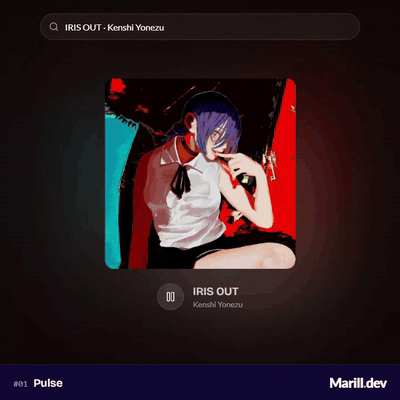

# Jour 1 : Pulse



Un jukebox : je cherche un morceau, sa pochette s'allume au centre et toute la page bat au rythme de l'extrait, jusqu'aux feux d'artifice quand le morceau « explose ».

## L'idée

Pour moi, un pouls se lit à plusieurs échelles de temps. Le volume fait respirer la pochette en continu. Les grosses caisses et les percussions font flasher deux grandes orbes, une par canal stéréo. Et quand le morceau « pète » (un refrain, un drop), des gerbes éclatent à l'écran. Toutes les couleurs viennent de la pochette. Au chargement, *Iris Out* est prêt : il suffit d'appuyer sur lecture.

## Comment c'est codé

**Les données.** La recherche interroge l'API de Deezer, sans clé. Faute d'en-têtes CORS, je l'appelle en JSONP ([`lib/deezer.ts`](./lib/deezer.ts)). Les extraits MP3 de 30 s sont, eux, servis avec CORS : Web Audio peut les analyser. Le navigateur interdit le son sans geste de l'utilisateur, donc le titre par défaut est seulement préchargé (pochette, thème, analyse).

**La pulsation.** [`lib/pulse-audio.ts`](./lib/pulse-audio.ts) branche un `<audio>` sur un graphe Web Audio. La branche d'analyse ne reçoit que 10 % du signal : un `AnalyserNode` renvoie des octets qui plafonnent à −30 dB, et un morceau qui tape fort resterait collé au maximum.

```ts
analysisGain.gain.value = ANALYSER_GAIN; // 0,1
this.analyser = ctx.createAnalyser();
this.analyser.fftSize = FFT_SIZE; // 32
output.connect(analysisGain).connect(this.analyser);
```

**Les orbes.** Un `ChannelSplitter` sépare gauche et droite. Chaque canal a son analyseur et deux [`OnsetDetector`](./lib/onset-detector.ts) : un pour la grosse caisse (30–110 Hz), un pour les percussions. Un détecteur ne déclenche que si la force est élevée *et* soudaine par rapport à son niveau récent : une basse tenue ne flashe pas. Une percussion fait monter le bas-médium et l'aigu en même temps, une note de piano non :

```ts
return Math.min(
  risenShare(prev, cur, sampleRate, fftSize, PERCUSSION_LO_HZ, PERCUSSION_SPLIT_HZ),
  risenShare(prev, cur, sampleRate, fftSize, PERCUSSION_SPLIT_HZ, PERCUSSION_HI_HZ),
);
```

**Les explosions.** Quand on choisit un titre, l'extrait entier est décodé et analysé à l'avance ([`lib/explosion-detector.ts`](./lib/explosion-detector.ts)). L'intensité mêle le volume et la « richesse spectrale » (part du spectre occupée, calculée avec ma propre FFT). Une explosion est une hausse nette par rapport aux 4 s précédentes, dans un passage riche. Le détecteur retrouve aussi les drops répétés (un trou net, puis un retour qui tient) et, pour un extrait déjà « à fond » dès le début, un repli : s'il est dense et fort dans son ensemble, ses passages forts comptent.

**Les gerbes.** Pendant une explosion, [`lib/band-onsets.ts`](./lib/band-onsets.ts) repère les attaques dans quatre bandes de fréquences. L'écart de niveau gauche/droite donne la position X, le Y est aléatoire, et la couleur est tirée de celles de la pochette. Le moteur de particules est maison ([`lib/fireworks.ts`](./lib/fireworks.ts)) : `fireworks-js` ne propose que des fusées, alors que je voulais l'explosion seule.

**Le thème.** [`lib/cover-theme.ts`](./lib/cover-theme.ts) reprend la chaîne de Material You (`@material/material-color-utilities`) : quantification des pixels, choix des couleurs, schéma sombre. Le fond de page prend la teinte de la pochette, très sombre.

Le composant [`day-01-pulse.ts`](./day-01-pulse.ts) relie le tout. Avec `?debug` dans l'adresse, un panneau affiche les passages détectés et le thème. Les orbes et les gerbes sont coupées si l'utilisateur demande moins d'animations.

## Lien avec le mot

Pulse, c'est le battement. La page en a trois : un souffle continu (le volume), des coups secs (grosses caisses, percussions) et de grands éclats quand le morceau change de dimension. Rien n'est animé à l'horloge : tout part du son.

## Pour aller plus loin

- Je n'ai que 30 s de chaque morceau et mes seuils sont réglés sur une trentaine d'extraits : la détection des explosions peut se tromper. Des titres entiers (un fichier déposé par l'utilisateur, par exemple) la rendraient bien plus fiable.
- Pour creuser : [`AnalyserNode` (MDN)](https://developer.mozilla.org/fr/docs/Web/API/AnalyserNode), [Material Color Utilities](https://github.com/material-foundation/material-color-utilities) et l'[API Deezer](https://developers.deezer.com/api).
