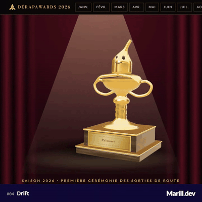

# Jour 4 : Drift



Une cérémonie de remise de prix : les Dérapawards, qui couronnent chaque mois le pire dérapage de l'actualité. On ouvre l'enveloppe du mois, un trophée en or entre en glissant sur scène, et on explore le podium et les mentions honorables.

## L'idée

« Drift » fait penser à une voiture qui glisse. J'ai pris le contrepied : un dérapage, c'est aussi une phrase qui sort de la route. Les faits sont dans [`derapawards-2026.json`](./derapawards-2026.json), avec une note de « kilométrage » sur 10 pour chaque dérapage. La cérémonie est un gala Art déco (rideaux, poursuite, Bodoni Moda) et le trophée est une peau de banane en or, souriante comme celle de Mario Kart, posée sur une coupe de Grand Prix dont le fût porte une trace de pneu.

## Comment c'est codé

**Tout vient du JSON.** [`lib/awards.ts`](./lib/awards.ts) décrit ses types et les fonctions pures qui en tirent le podium, les mentions (classées par note) et les liens entre dérapages. `checkAwards` repère les incohérences (id du podium absent, note qui n'est pas la somme des critères, lien cassé) ; un test de [`lib/awards.spec.ts`](./lib/awards.spec.ts) la lance sur le vrai fichier. [`day-04-drift.ts`](./day-04-drift.ts) le charge avec `resource()`, et le mois affiché vient du paramètre d'URL `?mois=2026-03`, lié à un `input()` par le routeur.

**Éditer le contenu.** Chaque mois a un champ `punchline` (vide par défaut) pour un commentaire éditorial écrit à la main, affiché avec le lauréat ; chaque dérapage peut aussi en avoir un. Les trois premiers de chaque mois ont un champ `image` (`url` et `source`) : l'image de partage de l'article cité, affichée en bandeau avec un lien vers sa source.

**Le trophée** est en three.js, chargé seulement avec ce jour ([`trophy-stage.ts`](./trophy-stage.ts)). La banane et ses pelures sont des solides « balayés » : une ellipse qui glisse le long d'un chemin en changeant de taille ([`trophy/sweep.ts`](./trophy/sweep.ts)).

```ts
target.set(
  r.p[0] + r.b[0] * w + r.n[0] * t,
  r.p[1] + r.b[1] * w + r.n[1] * t,
  r.p[2] + r.b[2] * w + r.n[2] * t,
);
```

Le visage est en laque noire posée sur le ventre ([`trophy/banana.ts`](./trophy/banana.ts)). La coupe est tournée au tour ([`trophy/cup.ts`](./trophy/cup.ts)), le socle a un marbre dessiné sur un canvas et une plaque dont le texte vient du JSON ([`trophy/plinth.ts`](./trophy/plinth.ts)). Pour que l'or ne reflète pas du noir, [`trophy/env.ts`](./trophy/env.ts) fabrique une salle de reflets avec quelques panneaux lumineux. Un seul contexte WebGL sert toute la page : changer de mois regrave la plaque et rejoue l'entrée ([`trophy/scene.ts`](./trophy/scene.ts)).

**L'entrée en dérapage** est une oscillation amortie : le trophée traverse sa place, la dépasse, revient, avec un lacet qui se rattrape.

```ts
const decay = Math.exp(-2.2 * t);
this.trophy.position.x = -7 * decay * Math.cos(3.4 * t);
this.trophy.rotation.y = 2.6 * decay * Math.cos(3.4 * t + 0.5);
```

**L'interface** : une enveloppe scellée ([`envelope.ts`](./envelope.ts)), un cadran de vitesse SVG pour le kilométrage ([`odometer.ts`](./odometer.ts)), des cartes dépliables avec citation, faits, sources et liens de « carambolage » vers les dérapages liés ([`nominee.ts`](./nominee.ts)). Les mois déjà ouverts sont gardés dans `sessionStorage`.

## Lien avec le mot

Le drift est partout : le trophée arrive en glissant et dépasse sa place, la trace de pneu monte le long du fût, la note s'appelle le kilométrage, et chaque mois est une sortie de route.

## Pour aller plus loin

- Une page pour les 2 à 3 dérapages « en chaîne » (les liens `declenche` du JSON) sous forme de frise.
- Un mode « tout le palmarès » qui fait défiler les dix trophées d'un coup.
- Le fichier indique que la vérification des citations n'est pas terminée : à relire avant toute publication.
