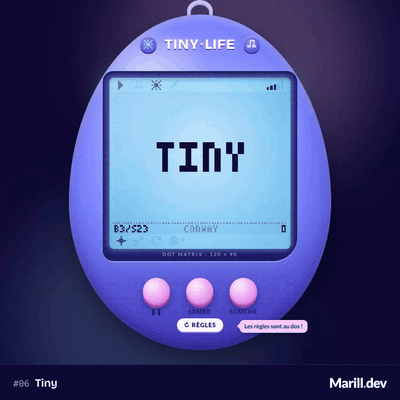

# Jour 6 : Tiny



TinyLife est un œuf virtuel de poche, avec écran LCD, qui élève des automates cellulaires : on choisit une souche ou on compose sa propre règle avec des interrupteurs au dos, on dessine sur l'écran et on regarde ce qui éclot.

## L'idée

« Tiny », c'est le jeu de la vie : une règle de six caractères (`B3/S23`) suffit à faire naître planeurs, canons et oscillateurs. Je l'ai rangé dans un jouet porte-clés à écran LCD, avec un monde de 120 × 90 cellules. On retourne l'œuf pour changer les lois de la physique.

## Comment c'est codé

Le monde ([`lib/world.ts`](./lib/world.ts)) est un tore : ce qui sort d'un bord revient par l'autre. Il tient dans deux `Uint8Array` qu'on échange à chaque génération, avec les indices des voisins précalculés pour trois voisinages : Moore (8), von Neumann (4) et hexagonal (6, à la façon de Golly). Une règle ([`lib/rule.ts`](./lib/rule.ts)) se résume à deux masques de 9 bits, « naître avec k voisines » et « survivre avec k voisines », plus un nombre d’états pour les règles _Generations_ comme Brian’s Brain, où une cellule qui meurt passe par des états d’agonie (extrait simplifié) :

```ts
if (s >= 2) {
  out = s + 1 >= states ? 0 : s + 1; // l'agonie avance, puis la cellule s'éteint
} else {
  let n = 0;
  for (let k = 0; k < degree; k++) n += alive[neighbors[base + k]];
  out = s === 0 ? table[n] : table[9 + n] ? 1 : states > 2 ? 2 : 0;
}
```

`parseRule` lit les notations courantes (`B3/S23`, `23/3`, `B2/S/C3`, `/2/3`, suffixes `H` et `V`). L'interrupteur B0 est soudé : avec lui, toutes les cellules mortes naîtraient d'un coup et l'écran clignoterait en entier.

L'écran ([`lib/lcd.ts`](./lib/lcd.ts)) est un canvas 2D. Chaque frame, la matrice (le monde plus un bandeau en police pixel 3 × 5 maison, [`lib/font.ts`](./lib/font.ts)) est écrite à un point par pixel dans un `ImageData`, puis agrandie sans lissage. Un masque creuse les interstices entre les pixels, et une copie décalée et pâle fait l'ombre portée sur le « papier », qui est le fond CSS de la vitre. Chaque pixel rejoint son niveau d'encre vite à l'allumage, lentement à l'extinction : c'est la rémanence des cristaux liquides, qui adoucit aussi le scintillement.

Le composant [`day-06-tiny.ts`](./day-06-tiny.ts) fait la glue : la boucle `requestAnimationFrame` joue 4 à 60 générations par seconde, indépendamment des images. Une détection de cycles ([`lib/cycle.ts`](./lib/cycle.ts), empreintes FNV-1a des 64 dernières générations) allume les pictogrammes de la vitre : figé, oscillateur et sa période, extinction. Les deux faces de l'œuf sont des composants à part : [`lib/egg-front.ts`](lib/egg-front.ts) pour la coque et l'écran, [`lib/egg-back.ts`](lib/egg-back.ts) pour l'éditeur, relié à la règle par `model()`. Un changement de règle s'applique en direct sur la population en cours.

« Au hasard » ([`lib/shuffle.ts`](./lib/shuffle.ts)) tire des règles et garde la première qui ne meurt pas, ne sature pas et ne se fige pas sur un tore d'essai de 48 × 48. Enfin, l'adresse suit l'état (règle, semis, graine, et même le dessin en RLE, [`lib/rle.ts`](./lib/rle.ts)) : le bouton de partage du site donne un lien qui rejoue exactement la même boîte.

## Lien avec le mot

Tout est petit : l'écran, le jouet, les cellules, les graines. Une seule cellule sous Gnarl ou un bloc de 4 sous Serviettes remplissent l'écran, et le R-pentomino ([`lib/patterns.ts`](./lib/patterns.ts)) ne compte que 5 cellules. Les 17 souches de [`lib/presets.ts`](./lib/presets.ts) montrent surtout qu'un ou deux interrupteurs de différence changent tout le monde.

## Pour aller plus loin

- Un vrai rendu hexagonal (lignes décalées d'une demi-cellule) : pour l'instant, le voisinage hexagonal s'affiche sur la grille carrée, comme dans Golly.
- Les règles _Larger than Life_ (voisinages de rayon R) et les règles non totalistiques en notation de Hensel.
- Sources : la [liste des règles life-like](https://conwaylife.com/wiki/List_of_Life-like_rules) et celle des [règles Generations](https://conwaylife.com/wiki/List_of_Generations_rules) de LifeWiki, et le format [RLE](https://conwaylife.com/wiki/Run_Length_Encoded).
