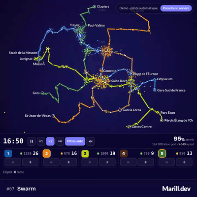

# Jour 7 : Swarm



Un mini-jeu de régulation du tram de Montpellier : de 6 h à 0 h 30, je répartis les rames, je dévie la 1, je coupe des stations et je donne des ordres aux rames pour que les foules ne débordent pas, malgré des imprévus tirés au hasard.

## L'idée

J'ai pris « Swarm » à contre-pied : pas d'étourneaux, mais la foule de l'heure de pointe, sur un réseau gratuit pour les habitants. Les stations, les temps de parcours et les rames en ligne viennent du GTFS de la TaM. Le joueur repère sur la carte ce qui coince (voiture sur la voie, rames en file, cortège) et répond avec les outils de la TaM : itinéraire bis, exploitation en tronçons, station non desservie, demi-tour, haut-le-pied.

## Comment c'est codé

**Les données.** [`tools/gtfs.mjs`](./tools/gtfs.mjs) écrit [`lib/network-data.ts`](./lib/network-data.ts) à partir du GTFS. [`lib/network.ts`](./lib/network.ts) applique une loupe `r' = r0 · asinh(r / r0)` qui grossit le centre-ville.

**Le plan d'exploitation.** Les incidents posent des obstructions ([`lib/obstruction.ts`](./lib/obstruction.ts)) qui arrêtent les rames, chez le joueur comme chez le fantôme. Seul le plan du joueur ([`lib/plan.ts`](./lib/plan.ts)) change les parcours : `deriveService` coupe chaque ligne en tronçons là où la circulation est interrompue, avec des terminus provisoires. Après chaque changement, [`lib/resnap.ts`](./lib/resnap.ts) recale chaque rame : elle continue, change de parcours, fait demi-tour ou se replie.

**Les voyageurs.** [`lib/router.ts`](./lib/router.ts) recalcule les trajets (Dijkstra) quand le réseau change, marche à pied comprise : jusqu'à 450 m entre deux stations. Corum et la Comédie sont à 679 m : couper la Comédie coûte cher.

**La simulation.** [`lib/sim.ts`](./lib/sim.ts) avance par pas de 3 secondes. Un quai n'accueille qu'une rame et l'arrêt dure tant que des gens montent, donc les rames finissent en paquets.

**Les imprévus.** [`lib/incidents.ts`](./lib/incidents.ts) tire la journée à partir d'une graine : grève (30 %), épisode méditerranéen (40 %), manif (50 %), et 3 à 5 incidents ponctuels (voiture, trottinette, malaise, panne, coupure de courant, colis). Le cortège fait le tour de l'Écusson au pas et bloque les stations qu'il couvre.

**Le fantôme.** [`lib/duel.ts`](./lib/duel.ts) fait jouer la même journée à un fantôme qui ne fait que répartir les rames au pilote automatique. Un seul flux de demande nourrit les deux camps :

```ts
step(dt: number, playerAutopilot = false): void {
  this.spawns.length = 0;
  this.stream.advance(this.player.time + dt, dt, this.spawns);
  this.player.step(dt, this.spawns);
  this.ghost.step(dt, this.spawns);
  // … le fantôme passe au pilote automatique toutes les 4 minutes
}
```

On compte +1 par voyageur arrivé, −3 par abandon, −1 au-delà de 10 minutes d'attente. `noteVsGhost` ([`lib/score.ts`](./lib/score.ts)) donne 10/20 à égalité, et un test miroir vérifie qu'un joueur au pilote automatique fait exactement le score du fantôme.

**L'équilibrage.** Le régulateur de [`lib/bots.ts`](./lib/bots.ts) n'utilise que les outils du joueur. Sur 4 journées, ne rien faire donne 0 à 1,5/20, le pilote automatique 10/20 et ce régulateur 12 à 17/20. [`lib/balance.spec.ts`](./lib/balance.spec.ts) vérifie que les outils ont un prix :

- pour une voiture, un colis ou une coupure de courant, couper rapporte ;
- pour une trottinette, couper coûte plus qu'attendre ;
- couper la Comédie ou garder la déviation sans raison fait perdre des points.

**L'essaim.** Dans [`lib/swarm.ts`](./lib/swarm.ts), un point vaut 10 voyageurs, attiré par sa station et repoussé par ses voisins. Le rendu ([`lib/render.ts`](./lib/render.ts)) est un canvas 2D.

## Lien avec le mot

L'essaim est partout : les nuées autour des stations, les rames qui roulent en paquets, le cortège rose qui avance. Le joueur ne contrôle aucun voyageur, seulement le réseau qui les porte.

## Simplifications assumées

- Sans les aiguillages, un demi-tour ou un terminus provisoire est possible partout.
- Une seule déviation, celle documentée de la 1 ([`lib/deviations.ts`](./lib/deviations.ts) en accepte d'autres).
- La demande est estimée, pas mesurée.
- Pas de bus de remplacement.

## Pour aller plus loin

- D'autres itinéraires bis, et le choix de la branche de la 3.
- Sources :
  - le [GTFS de la TaM](https://transport.data.gouv.fr/datasets/offre-de-transport-tam-en-temps-reel-gtfs-rt-urbain-et-suburbain) ;
  - la [déviation de la 1 par Pompignane en 2022](https://tramwaydemontpellier.net/2022/05/28/28-mai-2022-modification-des-itineraires-des-lignes-1-2-et-4-durant-la-premiere-phase-de-travaux-dentretien-et-de-modernisation-du-reseau-de-tramways-de-montpellier-programmee/) ;
  - les [lignes coupées en tronçons un jour de manif](https://www.rtsfm.com/montpellier-de-fortes-perturbations-a-prevoir-sur-le-reseau-tam-ce-jeudi) ;
  - la [Comédie non desservie en 2023](https://tramwaydemontpellier.net/2023/06/24/24-juin-2023-la-desserte-de-la-station-comedie-commune-aux-lignes-1-et-2-du-reseau-de-tramways-de-montpellier-repoussee-au-samedi-23-septembre-2023-mais-une-solution-transitoire-est-possible/).
