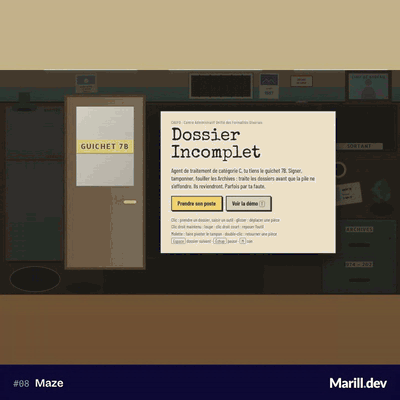

# Jour 8 : Maze



*Dossier Incomplet* : un jeu de guichet où je traite des dossiers administratifs absurdes (signer, tamponner, cocher, recopier, fouiller les Archives) avant que la pile ne s'effondre. Le lundi et le mardi sont jouables, et la touche T lance une démo.

## L'idée

Le labyrinthe, ici, c'est l'administration. Agent de catégorie C au guichet 7B, je suis les règles du bordereau, du mémo punaisé au mur et des petits caractères. Les dossiers reviennent par le tube pneumatique, parfois par ma faute, parfois « pour complément d'information ». Tout est injuste, mais rien n'est aléatoire : chaque retour porte son motif sur une fiche rose.

## Comment c'est codé

**Le contenu est de la donnée.** [`content/dossiers.ts`](./content/dossiers.ts) décrit 12 modèles de dossiers, [`content/pieces.ts`](./content/pieces.ts) une trentaine de pièces. Une ligne du bordereau = un geste, des paramètres et une condition écrite dans un petit langage ([`lib/expr.ts`](./lib/expr.ts), sans `eval`) :

```ts
{
  geste: 'tamponner',
  cible: 'formulaire.cachet',
  si: 'len(nouveau) > len(prenom)',
  alors: 'IRRECEVABLE',
  sinon: 'APPROUVE',
  texte: "Par économie d'encre, un prénom souhaité plus long que le prénom actuel est IRRECEVABLE…",
}
```

**La génération.** [`lib/generate.ts`](./lib/generate.ts) tire les variables à partir d'une graine : même graine, même journée. [`lib/layout.ts`](./lib/layout.ts) place chaque bloc dans sa feuille ; le rendu et les règles utilisent la même mise en page, donc le cadre où je tamponne est exactement celui que le jeu vérifie.

**Les règles.** [`lib/rules.ts`](./lib/rules.ts) contient une fonction pure par geste, qui rend `null` ou un motif (« Ligne 2 : tampon hors cadre »). Un tampon raté reste sur la feuille, sauf si un ANNULÉ net est posé par-dessus. Les signatures sont comparées aux trois signatures du spécimen déposé le lundi matin avec $P+ ([`lib/signature.ts`](./lib/signature.ts)) : les traits deviennent un nuage de points, normalisé axe par axe pour qu'une signature tassée dans un petit cadre reste la même, et chaque point porte l'angle de virage du tracé. J'ai calibré le seuil sur des signatures de synthèse déformées comme à la souris ([`lib/signature-samples.ts`](./lib/signature-samples.ts)) : un zigzag, un trait droit ou un gribouillis ne passent pas. Le lundi, un post-it dit tout de suite pourquoi une signature est refusée.

**La journée.** [`lib/bureau.ts`](./lib/bureau.ts) fait avancer l'horloge sans aucun affichage. Il gère les arrivées (avec un rush à 16 h), les retours R1, R2 et R3, l'effondrement au-delà de 12 unités d'épaisseur et le reliquat. [`lib/desk.ts`](./lib/desk.ts) traduit les gestes en coordonnées de scène (enfoncer, déplacer, relâcher, molette) en actions : outil en main, glisser, tracé du stylo, loupe. L'interface Angular ([`day-08-maze.ts`](./day-08-maze.ts)) affiche une scène de 1280 × 720 px mise à l'échelle. Les feuilles sont du DOM ([`lib/paper.ts`](./lib/paper.ts)), l'encre est du SVG, et chaque feuille ne se redessine que quand sa révision change.

**La démo et l'équilibrage.** [`lib/solve.ts`](./lib/solve.ts) calcule les gestes qui rendent un dossier conforme. Les tests s'en servent pour vérifier que chaque modèle est soluble sur 40 graines. La démo ([`lib/demo.ts`](./lib/demo.ts)) les exécute avec un curseur fantôme sur le même contrôleur que le joueur. Les bots de [`lib/bots.ts`](./lib/bots.ts) jouent des journées entières avec les temps par geste du GDD. `npm run balance` en lance 1000 par jour et par profil ; aujourd'hui, aucun profil ne fait s'effondrer la pile le lundi ou le mardi.

Le son ([`lib/audio.ts`](./lib/audio.ts)) est synthétisé en Web Audio : impact du tampon, grattement du stylo qui suit la vitesse du tracé, « pshhht » du tube, sonnerie de 17 h.

## Lien avec le mot

Le bordereau renvoie au mémo, le mémo à une règle, la pièce manquante aux Archives, où ses leurres diffèrent chacun d'un seul critère (le type, le nom ou la date). Un dossier fini repart par le Sortant et peut revenir par le tube, jusqu'à trois fois. C'est un labyrinthe de papier dont on ne sort que classé sans suite.

## Simplifications assumées

- Angular plutôt que Svelte (proposé par le GDD), pour rester dans l'application du mois.
- Seuls le lundi et le mardi (le MVP du GDD) sont jouables. Le « cachet du service » est le tampon VU.
- Dans la démo, le fantôme remet une pièce au premier plan sans cliquer dessus.

## Pour aller plus loin

- Mercredi à vendredi : photocopieuse, Gérard qui réécrit les champs (R5), Bureau 13 et bac ignifugé.
- Remplacer les temps du GDD par ceux mesurés en jeu (F3, puis E exporte le journal des gestes).
- [$P+](https://dl.acm.org/doi/10.1145/3136755.3136817) (Vatavu, 2017) et [$P](https://depts.washington.edu/acelab/proj/dollar/pdollar.html) (Vatavu, Anthony, Wobbrock, 2012).
