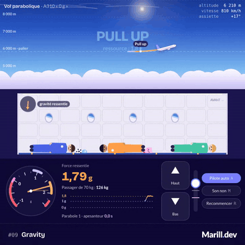

# Jour 9 : Gravity



Un vol parabolique à piloter avec deux boutons, haut et bas : dehors, la trajectoire se dessine, colorée par la force ressentie ; dedans, trois passagers, un ballon, une pomme, une bulle d'eau et des bonbons se mettent à flotter quand on réussit l'apesanteur.

## L'idée

Au retour de la Cité de l'espace, je voulais une expérience plutôt qu'un jeu : monter dans l'avion « zéro g » de Novespace. Le paradoxe que j'avais envie de montrer : en apesanteur, la gravité est toujours là, et tout tombe avec l'avion. Le profil visé est celui du guide de l'ESA : palier à 6 000 m et 810 km/h, ressource de 20 s à 1,8 g, injection vers 7 500 m à 47° en montée, sommet vers 8 500 m, sortie à −42°.

## Comment c'est codé

**Le vol** ([`lib/flight.ts`](./lib/flight.ts)) est un point matériel dans un plan vertical : vitesse V, pente γ, incidence α. L'air suit l'atmosphère type ([`lib/atmosphere.ts`](./lib/atmosphere.ts)), avec la compressibilité à Mach 0,7. Ce que ressent la cabine, c'est tout sauf le poids : la force spécifique (portance, traînée, poussée) projetée sur les axes du fuselage.

```ts
const fAlong = (T * cosA - D) / A.mass;
const fNormal = (L + T * sinA) / A.mass;
this.V = Math.max(40, this.V + (fAlong - g * Math.sin(this.gamma)) * dt);
this.gamma += ((fNormal - g * Math.cos(this.gamma)) / this.V) * dt;
this.nz = (fNormal * cosA - fAlong * sinA) / G0;
```

**Le manche.** Les boutons ▲ et ▼ (ou les flèches) déplacent le manche, qui reste où on le lâche. Sa position commande l'incidence, par une loi douce au centre et forte en butée ; les protections la bornent entre −1 et 2,5 g et avant le décrochage. Le repère rose du manche est l'incidence de portance nulle : la même à toutes les vitesses, c'est là qu'on tient 0 g. Les gaz sont automatiques, comme le troisième pilote à bord : en apesanteur, ils compensent la traînée.

**Le pilote automatique** ([`lib/autopilot.ts`](./lib/autopilot.ts), touche A, ou T pour une démo déjà dans la ressource) ne touche qu'au manche : il calcule l'incidence qui donne le facteur de charge voulu. Il tient 21,5 s d'apesanteur et culmine vers 8 400 m à 370 km/h. Le commandant ne reprend la main qu'en dernier recours : il simule sa propre ressource et n'intervient que si elle ne suffirait plus à rester au-dessus de 4 600 m et sous 955 km/h (ou au-delà de 65° d'assiette : sans lui, l'A310 enchaînait les loopings). Avant, une alarme de survitesse prévient, sans rien imposer. [`lib/phases.ts`](./lib/phases.ts) reconnaît les annonces « Pull up », « Injection », « Pull out » et chronomètre l'apesanteur (sous 0,05 g).

**La cabine** ([`lib/cabin.ts`](./lib/cabin.ts)) a son propre repère : rien n'y tombe « vers le bas », chaque corps subit l'opposé de la force spécifique de l'avion. Comme l'avion bascule de 90° pendant la parabole, elle ajoute les forces d'inertie de ce repère qui tourne. Passagers en capsules, objets en disques, avec rotation, chocs et frottement ; on les attrape et on les lance au pointeur.

```ts
setLoad(nx: number, nz: number): void {
  this.ax = -nx * G0;
  this.ay = -nz * G0;
}
```

**Le rendu** est en canvas 2D : la trace ([`lib/sky-view.ts`](./lib/sky-view.ts)), la cabine et ses hublots où l'horizon penche ([`lib/cabin-view.ts`](./lib/cabin-view.ts)), l'accéléromètre ([`lib/gauges.ts`](./lib/gauges.ts)). Le son vient de Web Audio ([`lib/audio.ts`](./lib/audio.ts)). [`day-09-gravity.ts`](./day-09-gravity.ts) fait tourner le tout à pas fixe (1/120 s).

## Lien avec le mot

La gravité ne change pas : environ 9,8 m/s², du début à la fin. Ce qui change, c'est ce qu'on en ressent. À 1,8 g, les passagers sont plaqués au plancher ; à 0 g, ils ouvrent les bras et flottent, parce que l'avion est en chute libre, même quand il monte encore vers son sommet. Le compteur affiche la force ressentie et le poids apparent d'un passager de 70 kg, de 126 kg à presque rien.

## Est-ce que c'est juste ?

L'apesanteur commence en montée : l'avion est en chute libre dès l'injection, à 47° de pente, et pas seulement quand il redescend. Le compteur peut lire un peu moins que zéro, comme en vol réel (entre −0,02 et +0,02 g selon l'ESA). Le profil, les sources et les hypothèses sont détaillés chiffre par chiffre dans [`VALIDATION.md`](./VALIDATION.md).

## Pour aller plus loin

- Les paraboles lunaires (0,16 g) et martiennes (0,38 g) que Novespace vole aussi : il suffit de viser un autre facteur de charge.
- [Le guide de l'ESA sur les vols paraboliques](https://wsn.spaceflight.esa.int/docs/EUG2LGPr3/EUG2LGPr3-5-ParabolicFlights.pdf), d'où viennent les chiffres du profil.
